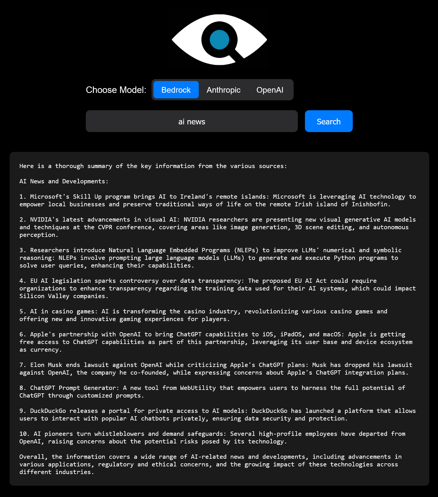

# QPAL - Query-based Parallel AI Lookup

QPAL (Query-based Parallel AI Lookup) is an AI-powered search summarization tool that utilizes various language models to provide comprehensive summaries of search results. It scrapes the plaintext content from relevant websites, summarizes the information using the selected language model, and presents the summarized results to the user.



## Features

- Perform Google searches and retrieve top search results
- Scrape plaintext content from websites concurrently
- Summarize webpages using different language models (Bedrock, Anthropic, OpenAI)
- Compile individual summaries into a single comprehensive summary
- User-friendly web interface for easy interaction

## Prerequisites

Before running the QPAL application, ensure that you have the following:

- Python 3.x installed
- Required Python packages (listed in `requirements.txt`)
- API keys for the language models you intend to use (Bedrock, Anthropic, OpenAI)

## Installation

1. Clone the QPAL repository:

   ```
   git clone https://github.com/qpd-v/qpal.git
   ```
   ```
   cd qpal
   ```

2. Rename "SAMPLE.env" to ".env" and edit the environment variables and replace these with yours:
   ```
   AWS_ACCESS_KEY_ID=your_aws_access_key_id
   AWS_SECRET_ACCESS_KEY=your_aws_secret_access_key
   AWS_REGION=your_aws_region
   AWS_MODEL=your_aws_model

   ANTHROPIC_API_KEY=your_anthropic_api_key
   ANTHROPIC_MODEL=your_anthropic_model

   OPENAI_API_KEY=your_openai_api_key
   OPENAI_MODEL=your_openai_model
   ```
3. Install requirements and run manually using app.py:
   ```
   pip install -r requirements.txt 
   ```
   ```
   python app.py
   ```
   OR
   

4. Run the `installer.bat` script to create a virtual environment and install the required packages:

   ```
   installer.bat
   ```

   Follow the prompts to choose whether you want to run QPAL immediately or not.

## Usage

If you chose not to run QPAL after installation, you can run it later using the `RUNQPAL.bat` script:

```
RUNQPAL.bat
```

This script will activate the virtual environment and start the QPAL application.

Once QPAL is running, follow these steps:
```
1. On the QPAL web interface, enter your search query in the provided input field.
2. Select the desired language model (Bedrock, Anthropic, or OpenAI) using the toggle switch.
3. Click the "Search" button to initiate the search and summarization process.
4. The application will perform the search, scrape relevant websites, summarize the information, and display the final summary on the web page.
```
## License

This project is licensed under the [GNU General Public License v3.0](https://www.gnu.org/licenses/gpl-3.0.en.html).

The GNU General Public License v3.0 is a copyleft license that allows users to use, modify, and distribute the software freely, but with the condition that any derivative works must be distributed under the same or a compatible license. This ensures that the source code remains open and accessible to the community.

## Contributing

Contributions to QPAL are welcome! 

If you find any issues or have suggestions for improvements, please open an issue or submit a pull request on the GitHub repository.

## Acknowledgements

- [Amazon Bedrock](https://aws.amazon.com/bedrock/)
- [Anthropic API](https://console.anthropic.com/)
- [OpenAI API](https://platform.openai.com/)